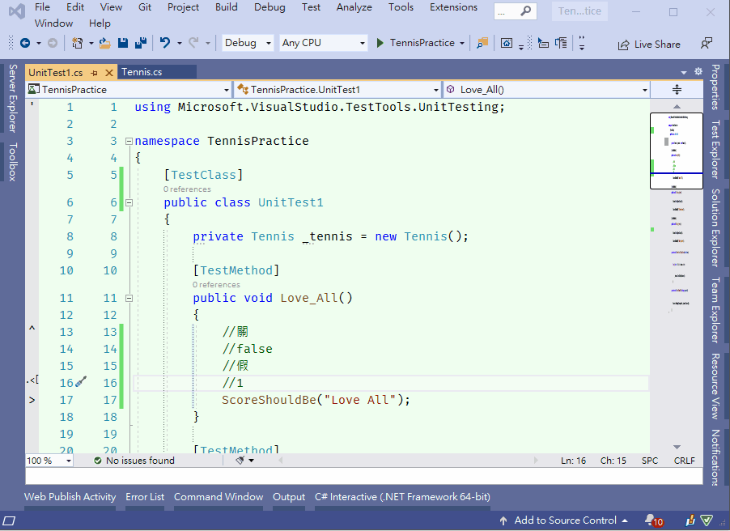
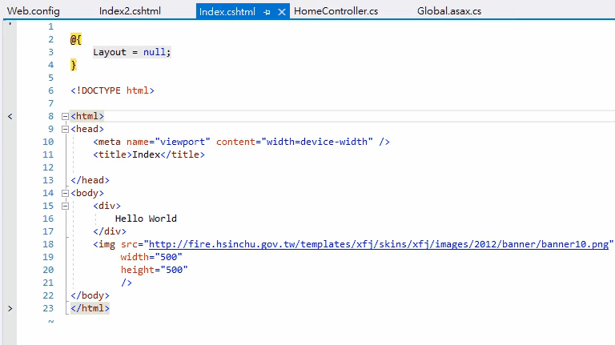

# VSIXProjectMultiLang

喇低賽的幫手 Visual Studio Extension , 提供自己一些日常會用到但是 Visual Studio & VsVim 沒有支援的功能 , 沒辦法只好自己土炮
需要看設定檔的話請參考 vsvimrc

## 功能介紹:
### 1. PostFixVar
如果沒錢買 Resharper 又很想用 postfix completion , 我有支援 .return .var 功能可以補全

### 2. Move To Method Begin
支援移動到目前的 Method 名稱上 , 省得在 VsVim 內還要做一些違反直覺的移動

### 3. Move To Method End
移動到尾端 => 沒屁啥用

### 4. Select Current Method
這個在 VsVim or Vim 內只有選目前花括號內的內容 , 但是日常會用到選整個 Method , 多多少少有用

### 5. AddChinese
忘了哪邊幹來的 code , 反正好像可以中文加法 , 太久了有點遺忘

### 6. ToVar , ToBool , ToInt , ToDouble , ToString
User 心如海底針 , 三不五時就切換型別 , 覺得太煩所以才搞這個 , 實際上沒啥屁用 , 用過大概幾次

### 7. GoToFile
恩 , 直接去到檔案 , 偶而用

### 8. ToEng
懶得打數字的英文幹印度人程式碼來用 , 實際上沒啥屁用 , 自己打還更快

### 9. Move To If Begin
這個算是有用 , 面對又臭又長的邏輯 code 常常就忘記自己在哪個 if block 要改條件 , 這個可以直接移動到條件式裡方便修改

### 10. 常見的切換功能
這個問題是被 User 逼瘋 , 常常有 true / false 要切換 , 不然就 0 / 1 切換 , 切來切去覺得賭爛所以乾脆弄個常見切換

### 11. 顯示多語系的繁體中文在畫面上
在 `Tools` => `Option` => `喇低賽的多語系顯示` => `多語系檔案路徑`
丟入你的 resx 像是這樣 D:\test\Lang.zh-TW.resx
即可在多語系的變數上面直接看到中文 , 不然一堆專業名詞還有印度英文實在不曉得變數是啥 ..

### 12. Matchit
Matchit 是一種快速移動到 tag 或是 bracket 的 vim extension
本來是想致敬 [emacs 大師的 Matchit](https://github.com/redguardtoo/vscode-matchit/blob/master/src/extension.ts)
實作過程中用 vsvim + SendKey 去模擬這個功能 , 所以有些不完美 , 只能手動設定快捷鍵 , 我是設定 `F3`
沒辦法用 `_vsvimrc` 去 remap key 成 `%`

### 13. AddJsonPropertyName
我受夠一堆舊的 .net 物件都要手動加 JsonPropertyName , 所以自己寫一個快速加的方法

